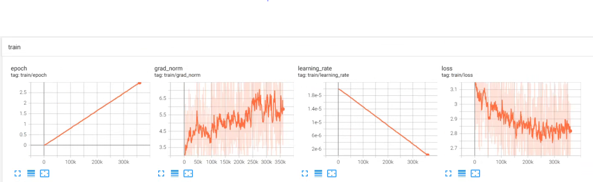
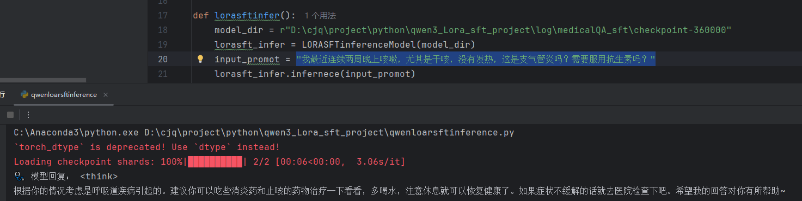

# qwen3_Lora_sft_medicalQA 
> This is a medical question-answering system fine-tuned using qwen3, lora and sft

## Prerequisities
The following dependencies are needed:
- peft
- datasets
- transformers
- pydantic
- torch >=2.5.1

## Installation
The first step is to install pytorch, and then install the dependent libraries of requirements.txt

## How to Use
**1、Datasets download**
* First, download the Chinese medical Q&A json file:https://huggingface.co/datasets/whalning/Chinese-medical-QA

**2、Preprocess**
* process json format files as jsonl format: run convertjsontojsonl.py
* process jsonl format files as Hugging Face Dataset format and save it to disk for subsequent training and validation:run processjsonltotokenizeddata.py

**3、Qwen3+Lora+SFT Training**
* Set sft_config.yaml.The model is set up according to your own computer configuration,If you have 3090 graphics card, can choose Qwen3-8b Model.
  
 model_name_or_path: "D:/3dlib/LLM/Qwen3-1.7B"
 
 train_data_path: "D:/cjq/project/python/qwen3_Lora_sft_project/data/tokenized/train"
 
 eval_data_path: "D:/cjq/project/python/qwen3_Lora_sft_project/data/tokenized/eval"
 
 output_dir: "log/medicalQA_sft"

* train model,Run the lorasfttrain function in the script of qwenloarsftinference.py 

**4、Inference**
* inference model,Run the lorasftinfer function in the script of qwenloarsftinference.py

## Result
Trained Loss

Inference Result

## Contact
* https://github.com/junqiangchen
* email: 1207173174@qq.com
* Contact:junqiangChen
* WeChat Public number: 最新医学影像技术
